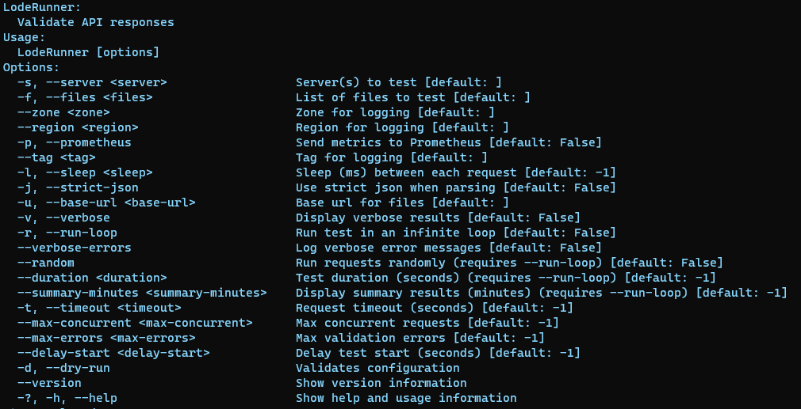

# Deploy Loderunner

## Background

To create a load test for our NGSA application, we need to run our end-to-end test tool (Loderunner) which generates https requests and sends them to our NGSA application. The Loderunner application needs to be deployed on our AKS cluster. Create a Kubernetes manifest file (yaml) to define and create the appropriate resource(s) needed to deploy Loderunner. Using the following inputs, Loderunner will generate approximately 1 request per second when deployed. More about Loderunner inputs can be found [here](#loderunner-parameters).

container:
    ghcr.io/retaildevcrews/ngsa-lr:beta
name:
    l8r-load-1
namespace:
    ngsa
args:
    -l  "1000", -r, -s https://< your subdomain name >.aks-sb.com, -f memory-benchmark.json , --prometheus

### Validate

After have applied your yaml file you can check your pod logs as follow:

```bash

# Get pods under ngsa namespace and locate the loderunner pod e.g. "l8r-load-1" and make sure it is up and runnning.
kubectl get pods -n ngsa

# Get pod logs for NGSA app e.g "ngsa-memory-79d5bb5cd7-dhwvf", utilize the "--tail" parameter to only get the last 10 log entries, then verify that the Date/time for each log entry is about 1 second apart.
kubectl logs <your ngsa-memory pod name> -n ngsa --tail 10

```

### Bonus

Modify the input arguments to have Loderunner (lr8) generate approximately 50 req/sec.

## Resources

- [Do we need WebV ??????????????](https://github.com/microsoft/webvalidate)
- [K8 Objects](https://kubernetes.io/docs/concepts/overview/working-with-objects/kubernetes-objects/)
- [Pods](https://kubernetes.io/docs/concepts/workloads/pods/)
- [Static-pod](https://kubernetes.io/docs/tasks/configure-pod-container/static-pod/)
- [K8 Cheatsheet](https://kubernetes.io/docs/reference/kubectl/cheatsheet/#creating-objects)

## Hints

### Loderunner Parameters


